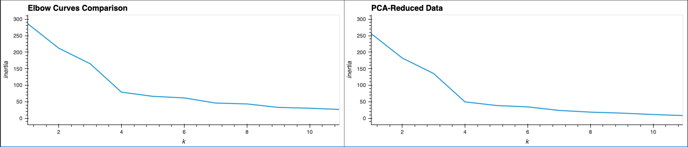
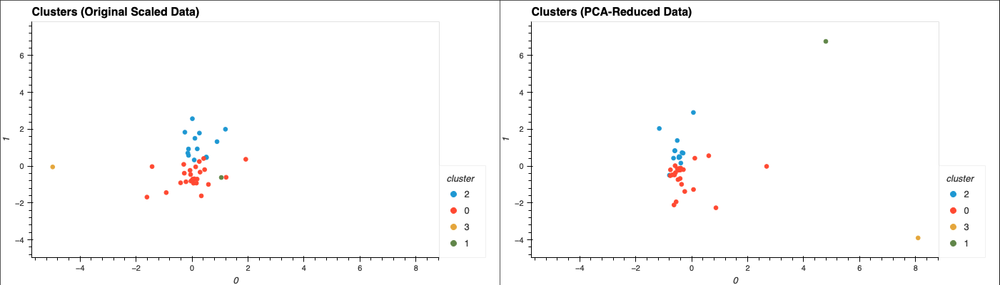

# **Crypto Clustering Project: K-Means & PCA**

Created by Matthew Guy, 2025

A machine learning-based clustering project using **Python, Pandas, hvPlot, scikit-learn, and PCA**. This notebook uses unsupervised learning techniques to group cryptocurrencies based on their recent market performance. The project explores the impact of dimensionality reduction using **Principal Component Analysis (PCA)** and compares clustering results before and after feature optimization.

---

## **Table of Contents**
- [Features](#features)
- [Installation](#installation)
- [Usage Instructions](#usage-instructions)
- [Dataset Details](#dataset-details)
- [Clustering Process](#clustering-process)
- [Cluster Preview](#cluster-preview)
- [Deployment](#deployment)
- [Future Enhancements](#future-enhancements)
- [About](#about)
- [Resources](#resources)

---

## **Features**

**Cryptocurrency Market Analysis**: Processes crypto market data for key performance metrics.  
**K-Means Clustering**: Groups cryptocurrencies based on market behavior using the elbow method to determine optimal clusters.  
**Dimensionality Reduction**: Applies PCA to simplify features while retaining explanatory power.  
**Interactive Visualizations**: Uses hvPlot to visualize elbow curves and clustering results before and after PCA.  
**Cluster Comparison**: Side-by-side visual comparison of clustering with original and reduced features.

---

## **Installation**

### **Requirements**
- GitHub Account  
- Python 3.7+  
- Jupyter Notebook  
- Required Libraries:
  - `pandas`, `scikit-learn`, `hvplot`, `matplotlib`

### **Quick Start Setup**

1. Clone or download the repository.  
2. Open the project in VS Code or JupyterLab.  
3. Run the Jupyter Notebook: `Crypto_Clustering.ipynb`

Directory structure:

&nbsp;&nbsp;&nbsp;&nbsp;📁 crypto-clustering  
&nbsp;&nbsp;&nbsp;&nbsp;├── Resources/  
&nbsp;&nbsp;&nbsp;&nbsp;│&nbsp;&nbsp;&nbsp;&nbsp;└── crypto_market_data.csv  
&nbsp;&nbsp;&nbsp;&nbsp;├── crypto_clustering.ipynb  
&nbsp;&nbsp;&nbsp;&nbsp;└── README.md  

---

## **Usage Instructions**

- Launch Jupyter Notebook  
- Run each cell in order, following the markdown guidance  
- Observe how the elbow curve identifies the best `k`  
- Compare K-Means clusters before and after PCA  
- Use interactive scatter plots to inspect how coins are grouped

---

## **Dataset Details**

- **File**: `crypto_market_data.csv`  
- **Index**: `coin_id`  
- **Features**:  
  - `price_change_percentage_24h`, `price_change_percentage_7d`, and other market-based metrics  
- Source: Provided within bootcamp module — based on real crypto trends

---

## **Clustering Process**

- StandardScaler used to normalize feature ranges  
- K-Means applied to both full feature set and PCA-reduced set  
- PCA reduced the data to 3 principal components while retaining ~89.5% of variance  
- Optimal number of clusters (`k = 4`) determined using the elbow method  
- Scatter plots used to visualize cluster groupings

---

## **Cluster Preview**

### Elbow Curve Comparison  
Displays optimal `k` for both the original and PCA datasets.  

### Cluster Visualization  
Visualizes clustering with and without PCA.  

---

## **Deployment**

To run the project locally:

1. Open the repository folder in VS Code  
2. Launch JupyterLab or run `jupyter notebook` in terminal  
3. Open `crypto_clustering.ipynb`  
4. Execute cells in order to generate all visual outputs  
5. Optional: Export or save as HTML or PDF for submission

---

## **Future Enhancements**

- Add dynamic filters for coin selection  
- Connect to real-time API (e.g., CoinGecko or CoinMarketCap)  
- Automate retraining and clustering daily  
- Include additional features (e.g., volume, liquidity, volatility)

---

## **About**

This project was built as part of the Module 20 Unsupervised Learning Challenge. It reinforces practical machine learning concepts including K-Means clustering, data normalization, dimensionality reduction with PCA, and interactive plotting with hvPlot.

---

## **Resources**

- [scikit-learn Documentation](https://scikit-learn.org)  
- [Pandas Documentation](https://pandas.pydata.org)  
- [hvPlot Documentation](https://hvplot.holoviz.org/)  
- [Principal Component Analysis - Wikipedia](https://en.wikipedia.org/wiki/Principal_component_analysis)  
- **DU Bootcamp Module 19**: Source of starter code, data, project structure, PCA application, and elbow visualization.  
- **ChatGPT**: Assisted with syntax for plotting code cells, structured commenting.  
